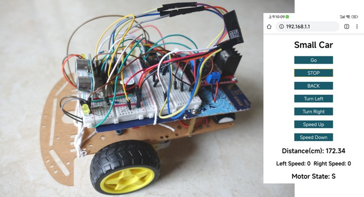

# Small Car Using Arduino Pro Mini and ESP8266

The Small Car can be controlled with infrared and WIFI.

## ​Components

* Arduino Pro Mini x1
* ESP8266-01S x1
* Shift Register：74HC595N  x1
* Ultrasonic Sensor：HC-SR04 x1   
* Motor Drive：L298N x1
* IR Receiver： VS1838B x1
* Speed Detection 
  * Encoder Wheel x2
  * H206 Optical Interrupter Sensor x2
* LED: 5mm Yellow x2
* Resistor: 220Ω x2, 100K x1
* Capacitance：47μF x1, 0.1μF x1
* Buzzer(active) x1
* 2WD Chassis x1 
* Power: 7.4V 800mAh Lithium Battery x1
* Mini Breadboard x2
* Connecting Wires and Jumper Wires
* [21 Keys MP3 IR Remote Controller x1](https://kzyeducabot.en.made-in-china.com/product/sNuEFmJvAkcM/China-21-Keys-Remote-Controller-MP3-Decording-Board-IR-Remoter-Control.html)

